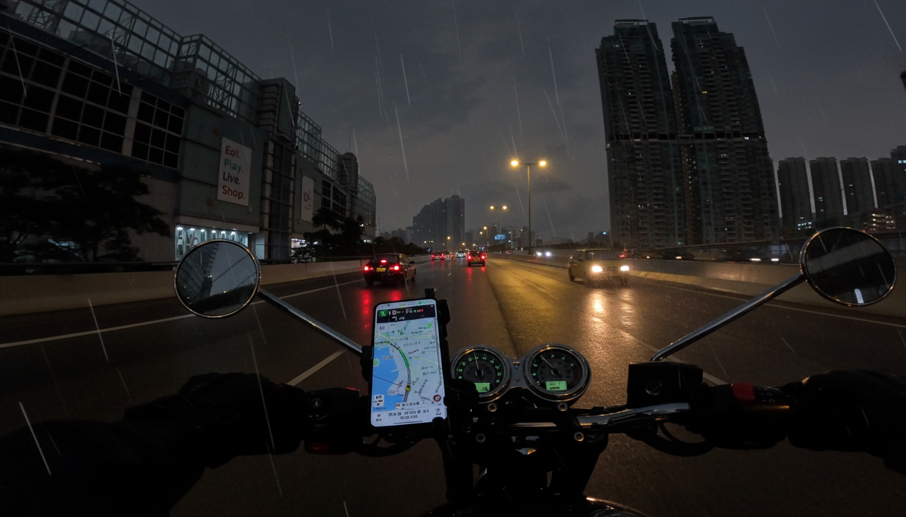
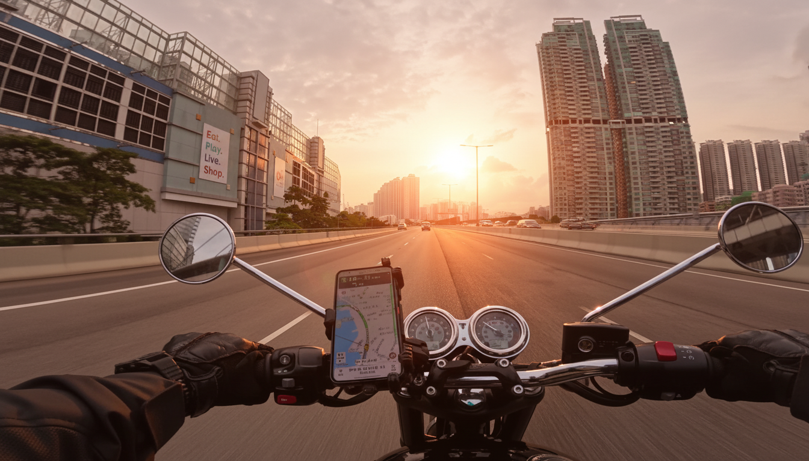
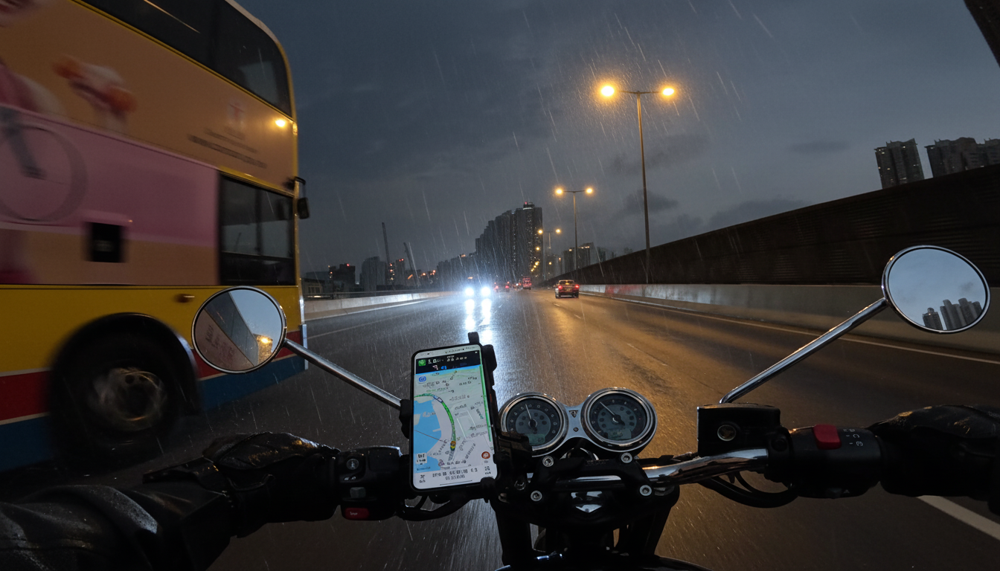

<div align="center">

# 摩托车 POV 天气增强与视频生成（Data Augmentation Stage 1）

<a href="https://github.com/ARCHIC001/data-augmentation-stage-1">GitHub Repo</a> · 文档：docs/

</div>

---

## Overview
- Goal: Starting from first-person perspective images of motorcycles, batch change to various weather conditions (sunny/sunset/heavy rain/night rain/fog) and generate coherent videos.
- Key points: Geometry and traffic elements remain unchanged, strong consistency within groups, automated processes, configurable and reproducible.
- Output structure:
  - Images: `outputimg/<scene>/<weather>/<frame>_<weather>.png`
  - Videos: `outputmp4/<scene>/<weather>/<scene>_<weather>.mp4`

---
## Directory Structure
```
input/                    # Original frame extraction
outputimg/                # Image weather enhancement output
outputmp4/                # Video output
configs/                  # Unified configuration (API Key / batch processing parameters)
prompts/                  # Prompt templates for images and videos
scripts/                  # Batch processing scripts
```

---

## Quick Start
1) Installation and Key
```bash
python3 -m pip install -r requirements.txt
export GEMINI_API_KEY="<your_key>"  # Or write it in configs/gemini_api_key.txt
```
2) Batch Weather Enhancement (Independent Frame-by-Frame, Avoid Composition Adhesion)
```bash
python3 scripts/gemini_weather_pairs.py configs/gemini_weather.yaml
```
3) Batch Video Generation (8 seconds by default, first frame as reference)
```bash
python3 scripts/veo_video_batch.py configs/veo_video_batch.yaml
```

---

## Results

### Image comparison (with first reference frame + last reference frame)
<table>
  <tr>
    <th>original input</th>
    <th>Dense Fog</th>
    <th>Sunny</th>
    <th>Heavy Rain</th>
    <th>Rainy Night</th>
    <th>Sunset Backlight</th>
  </tr>
  <tr>
    <td></td>
    <td></td>
    <td></td>
    <td></td>
    <td></td>
    <td></td>
  </tr>
  <tr>
    <td></td>
    <td></td>
    <td></td>
    <td></td>
    <td></td>
    <td></td>
  </tr>
  <tr>
    
  </tr>
  </table>

### video demo
<div>
  <td></td>
  <video src="assets/demo1.mp4" width="1280" controls></video> 
   <p>
  **The same video can have its weather changed arbitrarily while ensuring the consistency of roads and buildings. Display 5 types of weather effect changes.**  
  </p>  
  
  <td></td>
  <video src="assets/demo2.mp4" width="1280" controls></video>

  <p>
  **Controlling the generation of the first and last frame images and comparing them with the original video can better control the generation quality.**
  </p>
  <p>
    若浏览器不自动预览：
    <a href="assets/demo1.mp4">点击下载/查看 MP4</a>
  </p>
  <!-- 可复制上面 video 块，替换为其他天气的视频路径 -->
  <!-- <video src="../outputmp4/6/sunny/6_sunny.mp4" width="720" controls></video> -->
  <!-- <video src="../outputmp4/6/heavy_rain/6_heavy_rain.mp4" width="720" controls></video> -->
</div>


---

## Prompt Principles and Consistency
- Image phase:
  - Positive aspects: Maintain POV and geometry + weather characteristics + color tone/lighting;
  - Negative aspects: It is prohibited to add/delete vehicles and objects, to change roads and signs, and to have artifacts/overexposure;
  - Intra-group consistency: Unified prompts, low creativity, high fidelity, and color alignment through post-processing when necessary.
- Video phase:
  - First frame reference + stable video prompts (`prompts/video/*.yaml`); if the API supports `last_frame`, then enable interpolation;
  - Fixed reference frame selection logic: Prioritize `0000*` and `0008*`, otherwise take the first/last file.
---

---

## License & Citation
only for stf development show.
