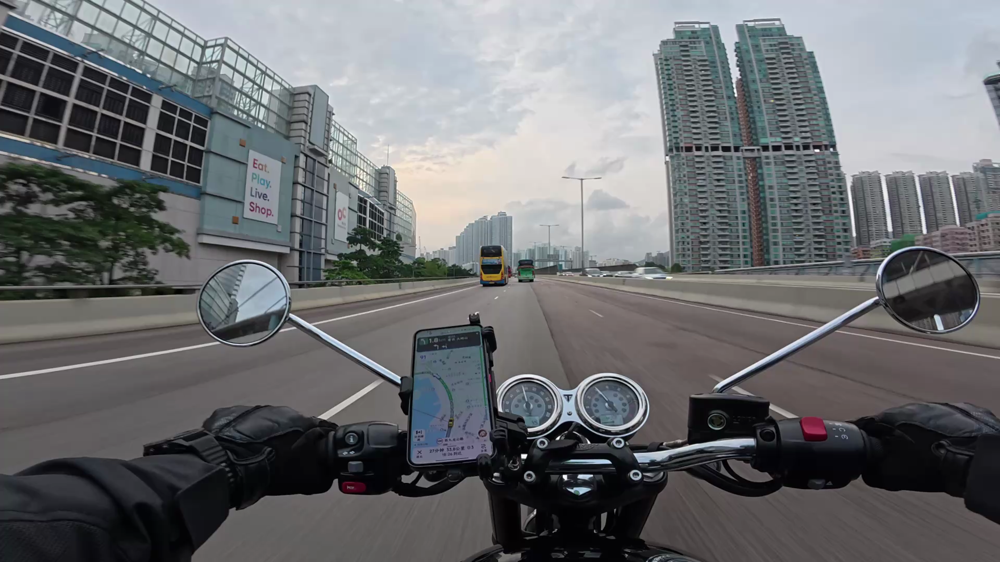
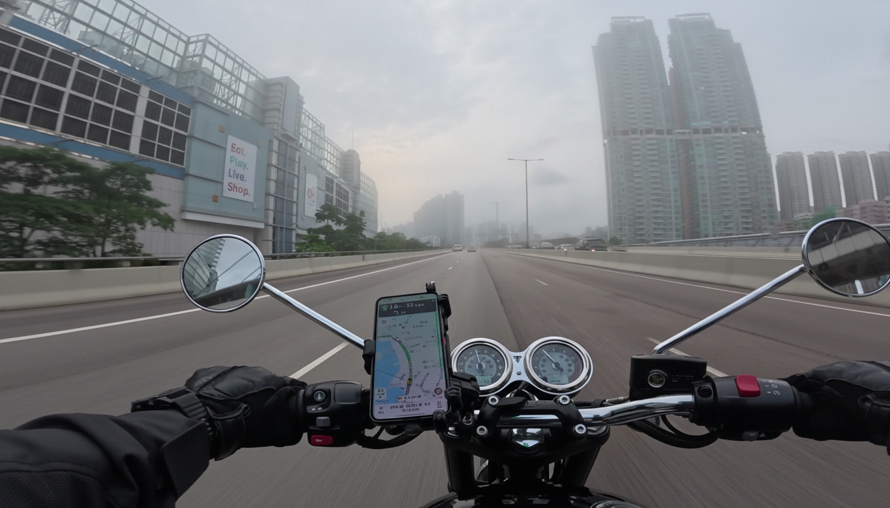
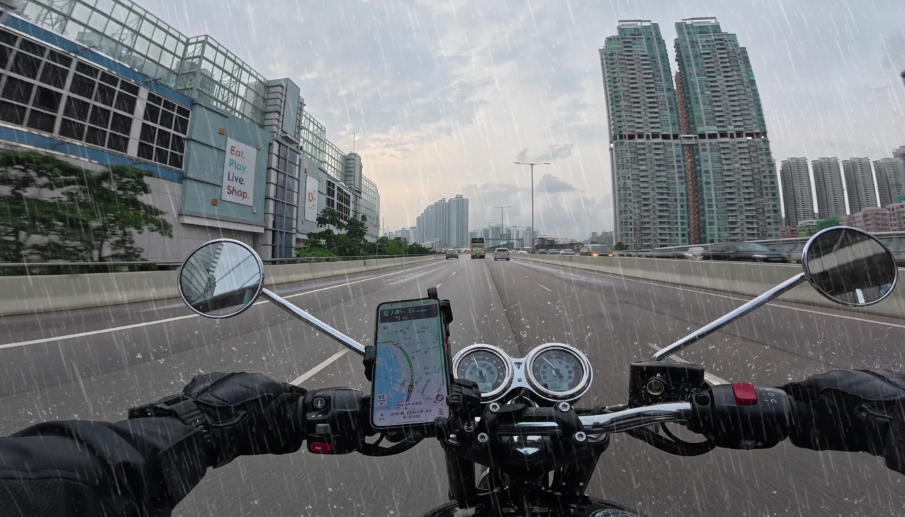
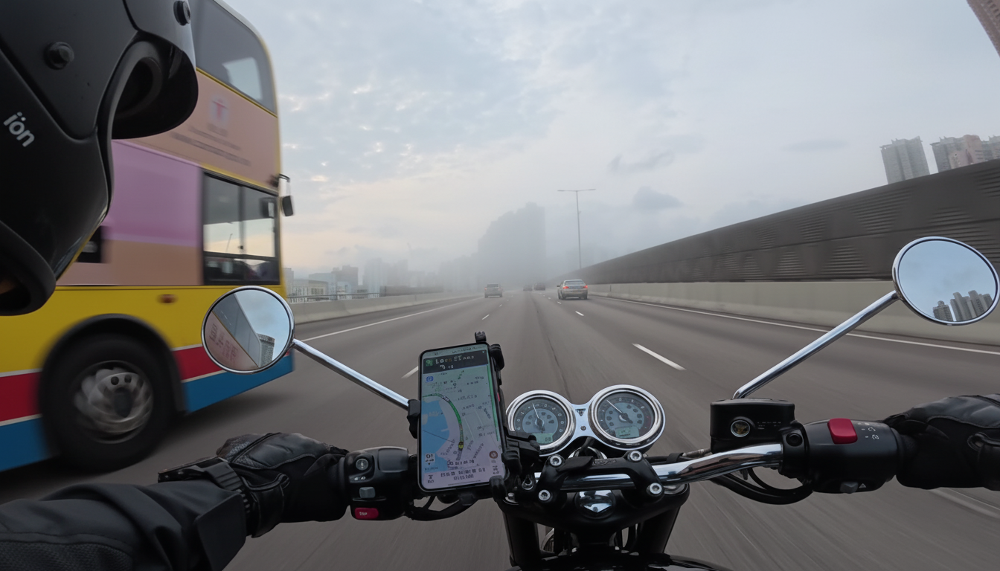
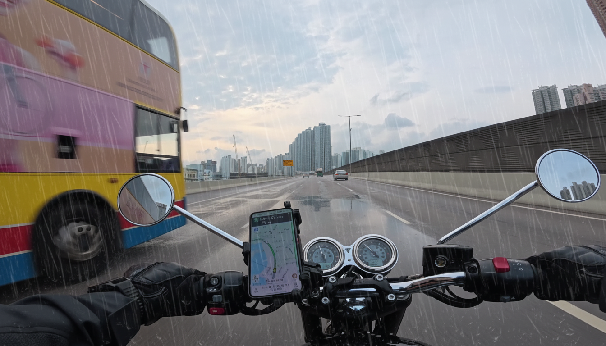

<div align="center">

# 摩托车 POV 天气增强与视频生成（Data Augmentation Stage 1）

<a href="https://github.com/ARCHIC001/data-augmentation-stage-1">GitHub Repo</a> · 文档：docs/

</div>

---

## 概览
- 目标：从摩托车第一视角图像出发，批量改换多种天气（晴/夕阳/大雨/夜雨/大雾），并生成连贯视频。
- 重点：几何与交通要素不变、组内一致性强、流程自动化、可配置可复现。
- 输出结构：
  - 图片：`outputimg/<scene>/<weather>/<frame>_<weather>.png`
  - 视频：`outputmp4/<scene>/<weather>/<scene>_<weather>.mp4`

---

## 目录结构
```
input/                    # 原始抽帧
outputimg/                # 图片天气增强输出
outputmp4/                # 视频输出
configs/                  # 统一配置（API Key / 批处理参数）
prompts/                  # 图片与视频的 Prompt 模板
scripts/                  # 批处理脚本
```

---

## 快速开始
1) 安装与 Key
```bash
python3 -m pip install -r requirements.txt
export GEMINI_API_KEY="<your_key>"  # 或在 configs/gemini_api_key.txt 写入
```
2) 批量天气增强（独立逐帧，避免构图粘连）
```bash
python3 scripts/gemini_weather_pairs.py configs/gemini_weather.yaml
```
3) 批量视频生成（默认 8 秒，首帧参考）
```bash
python3 scripts/veo_video_batch.py configs/veo_video_batch.yaml
```

---

## 结果展示（Results）

### 图片对比（首帧 vs. 尾帧）
<table>
  <tr>
    <th>原始首帧</th>
    <th>大雾首帧</th>
    <th>晴天空气首帧</th>
    <th>暴雨首帧</th>
  </tr>
  <tr>
    <td></td>
    <td></td>
    <td></td>
    <td></td>
  </tr>
  <tr>
    <th>原始尾帧</th>
    <th>大雾尾帧</th>
    <th>晴空气尾帧</th>
    <th>暴雨尾帧</th>
  </tr>
  <tr>
    <td></td>
    <td></td>
    <td></td>
    <td></td>
  </tr>
</table>

> 更多天气（夜雨、夕阳）可复制该表格并替换 `assets/` 下相应文件。

### 视频示例
<div align="center">
  <video src="assets/6_dense_fog.mp4" width="720" controls></video>
  <p>
    若浏览器不自动播放，可 <a href="assets/6_dense_fog.mp4">下载 MP4</a> 或查看 GIF 预览。
  </p>
  
</div>


---

## Prompt 原则与一致性
- 图片阶段：
  - 正向：POV 与几何保持 + 天气特征 + 色调/光照；
  - 负向：禁止新增/删除车辆与物体、禁止改变道路与标志、禁止伪影/过曝；
  - 组内一致性：统一 prompt、低创造性（creativity）、较高保真（fidelity），必要时后处理做颜色对齐。
- 视频阶段：
  - 首帧参考 + 稳定视频 prompt（`prompts/video/*.yaml`）；若 API 支持 `last_frame` 再开启插值；
  - 固定参考帧选择逻辑：优先 `0000*` 与 `0008*`，否则取首/尾文件。

---


---

## 将本页发布到 GitHub Pages（可选）
- 在仓库 Settings → Pages：
  - Source 选择 `Deploy from a branch`；
  - Branch 选择 `main`，文件夹选择 `/docs`；
- 将本文件命名为 `docs/index.md` 或在 `docs/` 下新建 `index.md` 引用本页：
```md
---
redirect_to: jieshao.md
---
```
- 稍后访问仓库 Pages URL 即可查看在线演示页。

---

## License & Citation
only for development show.
